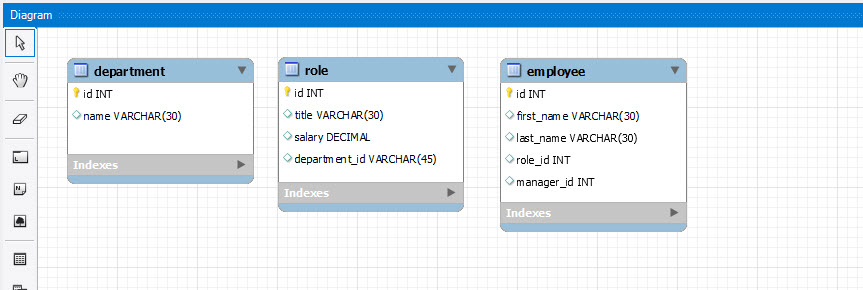
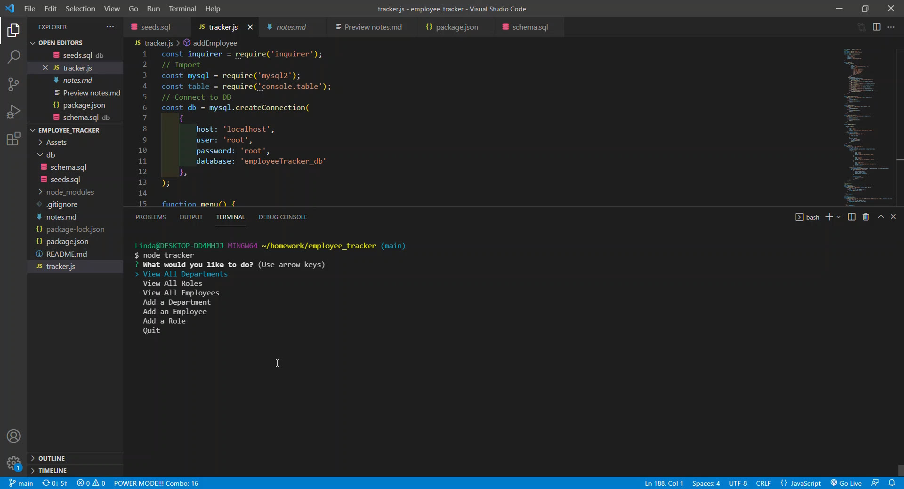
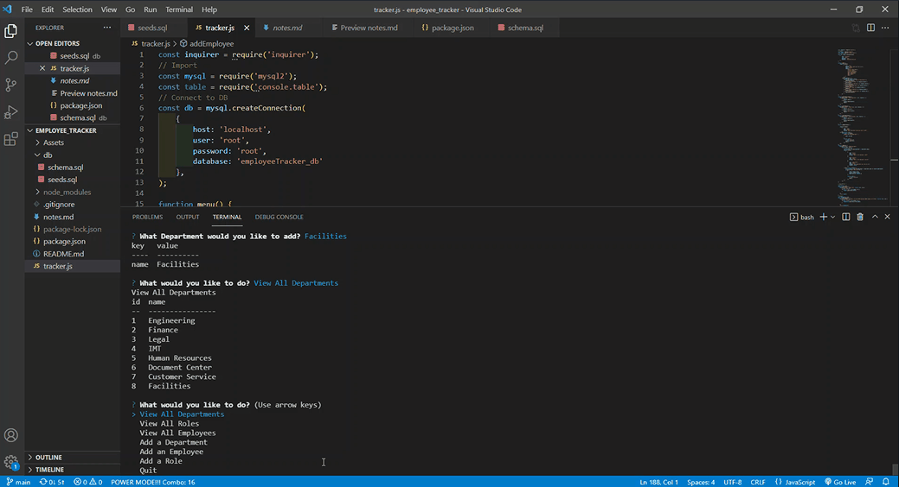

# Employee Tracker

Overview: 
In this project I created a content management systems (CMS).  This  interface allows non-developers to easily view and interact with information stored in databases. Through a command-line in the terminal, you can  choose options on how to manage a company's employee database, using Node.js, Inquirer, and MySQL.

## Table of Contents 

* [Links](#links)

* [Installation](#installation)

* [Usage](#usage)

* [Preview](#preview)

* [Criteria](#criteria)

* [Contact](#contact)

* [Credits](#credits)

* [License](#license)

# Links

### YouTube Link
https://youtu.be/ApmpN9A0cS4

### GitHub Link
https://github.com/lindamart/employee_tracker


# Installation

To function this application needs:

* console.table 
* Inquirer
* MySQL
* dotenv


[Back to Table of Contents](#table-of-contents)

# Usage
Type ```node tracker``` to invoke the application. 

Use the ```up and down arrow keys``` to navigate the menu in order to view, create and delete departments, roles and employees in the system.


[Back to Table of Contents](#table-of-contents)
# Preview

### MySQL Workbench


### Application Invoked and Main Menu Presented


### Add Employee



[Back to Table of Contents](#table-of-contents)

# Criteria

```
GIVEN a command-line application that accepts user input

WHEN I start the application
THEN I am presented with the following options: view all departments, view all roles, view all employees, add a department, add a role, add an employee, and update an employee role

WHEN I choose to view all departments
THEN I am presented with a formatted table showing department names and department ids

WHEN I choose to view all roles
THEN I am presented with the job title, role id, the department that role belongs to, and the salary for that role

WHEN I choose to view all employees
THEN I am presented with a formatted table showing employee data, including employee ids, first names, last names, job titles, departments, salaries, and managers that the employees report to

WHEN I choose to add a department
THEN I am prompted to enter the name of the department and that department is added to the database

WHEN I choose to add a role
THEN I am prompted to enter the name, salary, and department for the role and that role is added to the database

WHEN I choose to add an employee
THEN I am prompted to enter the employee’s first name, last name, role, and manager, and that employee is added to the database

WHEN I choose to update an employee role
THEN I am prompted to select an employee to update and their new role and this information is updated in the database 
```


[Back to Table of Contents](#table-of-contents)
# Contact

Contact me with any questions.

Linda Martinez [lindanmjw@gmail.com](mailto:lindanmjw@gmail.com)

[Back to Table of Contents](#table-of-contents)
# Credits 

W3 Schools: https://www.w3schools.com/

MDN Web Docs: https://developer.mozilla.org/en-US

npm Inquirer: https://www.npmjs.com/package/inquirer

npm MySql: https://www.npmjs.com/package/mysql2

MySQL: https://devhints.io/mysql

MySQL Workbench: https://dev.mysql.com/doc/workbench/en/

[Back to Table of Contents](#table-of-contents)
# License

The MIT License (MIT)

Copyright (c) 2022 Linda Martinez

Permission is hereby granted, free of charge, to any person obtaining a copy of this software and associated documentation files (the "Software"), to deal in the Software without restriction, including without limitation the rights to use, copy, modify, merge, publish, distribute, sublicense, and/or sell copies of the Software, and to permit persons to whom the Software is furnished to do so, subject to the following conditions:

The above copyright notice and this permission notice shall be included in all copies or substantial portions of the Software.

THE SOFTWARE IS PROVIDED "AS IS", WITHOUT WARRANTY OF ANY KIND, EXPRESS OR IMPLIED, INCLUDING BUT NOT LIMITED TO THE WARRANTIES OF MERCHANTABILITY, FITNESS FOR A PARTICULAR PURPOSE AND NONINFRINGEMENT. IN NO EVENT SHALL THE AUTHORS OR COPYRIGHT HOLDERS BE LIABLE FOR ANY CLAIM, DAMAGES OR OTHER LIABILITY, WHETHER IN AN ACTION OF CONTRACT, TORT OR OTHERWISE, ARISING FROM, OUT OF OR IN CONNECTION WITH THE SOFTWARE OR THE USE OR OTHER DEALINGS IN THE SOFTWARE.
  
[Back to Table of Contents](#table-of-contents)